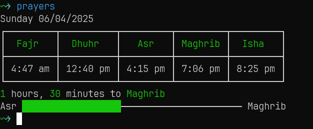

# Prayer Times Cli
[](https://pkg.go.dev/github.com/mabd-dev/prayer-times-cli#section-documentation)


Cli tool to show prayer times of any day you want



Features
- Show prayer times to current day (or provide a specific day if you want)
- Show time left till next prayer


## Installation
1.  **Install go package:**
    ```bash
    go install github.com/mabd-dev/prayer-times-cli
    ```
2. **Rename cli command (optional)**

   go to `~/go/bin` and rename prayer-times-cli to prayers like this:
   ```sh
   sudo mv prayer-times-cli prayers
   ```

## Usage
NOTE: use `prayer-times-cli` if you did not rename it to `prayers`

```sh
prayers # will show prayer times of the day
```
```sh
prayers -y 2025 -m 5 -d 11 

# Or
prayers --year 2025 --month 5 --day 11 
```
By default year, month and day are today's dates, but you can override any of them to values you like. 
> NOTE: datas in future years might not work


## Roadmap
Check [issues](https://github.com/MABD-dev/prayer-times-cli/issues)

<br/><br/><br/>

# Special Thanks To

[ibad-al-rahman/prayer-times](https://github.com/ibad-al-rahman/prayer-times)
